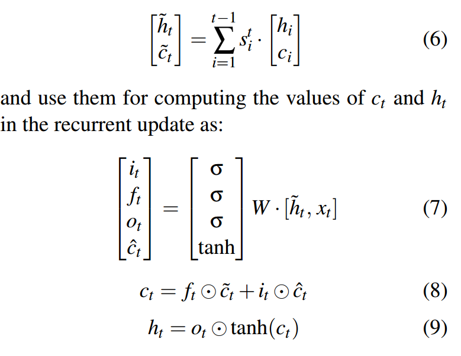

## Long Short-Term Memory-Networks for Machine Reading

### LSTM的问题
* given the current state ht, the next state ht+1 is conditionally independent of states h1 ···ht−1 and tokens x1 ··· xt. 
While the recursive state update is performed in a Markov manner, it is assumed that LSTMs maintain unbounded memory
(i.e., the current state alone summarizes well the tokens it has seen so far). This assumption may fail in practice, 
for example when the sequence is long or when the memory size is not large enough. Another undesired property of LSTMs concerns modeling
structured input.

*  An LSTM aggregates information on a token-by-token basis in sequential order, but there is no explicit mechanism for reasoning over
structure and modeling relations between tokens

### 解决办法

* Our solution is to modify the standard LSTM structure by replacing the memory cell with a memory network

* The resulting Long Short-Term Memory-Network (LSTMN) stores the contextual representation of each input token with
a unique memory slot and the size of the memory grows with time until an upper bound of the memory span is reached.

### 计算过程

Let xt denote the current input; Ct−1 = (c1,··· , ct−1) denotes the current memory tape, and Ht−1 = (h1,··· ,ht−1)
the previous hidden tape. At time step t, the model computes the relation between xt and x1 ··· xt−1
through h1 ···ht−1 with an attention layer:

)

)

