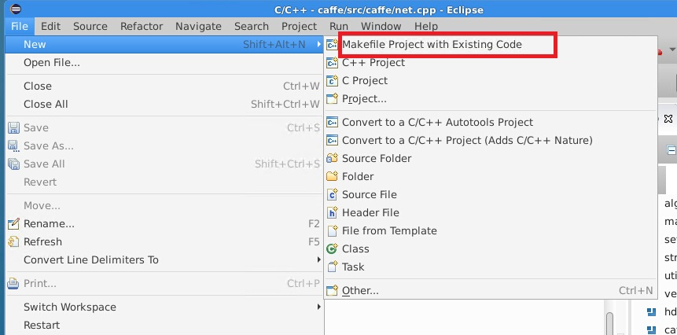
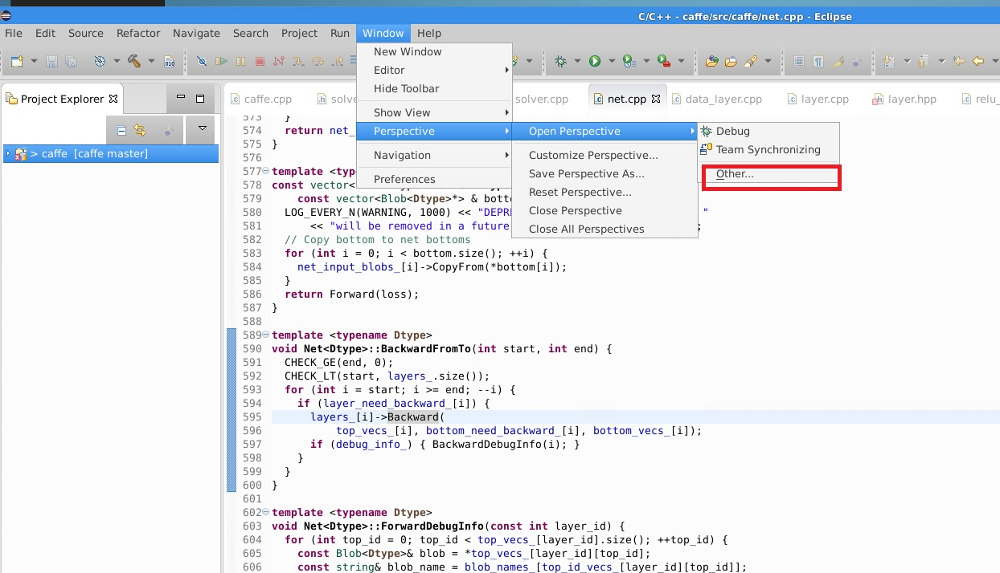
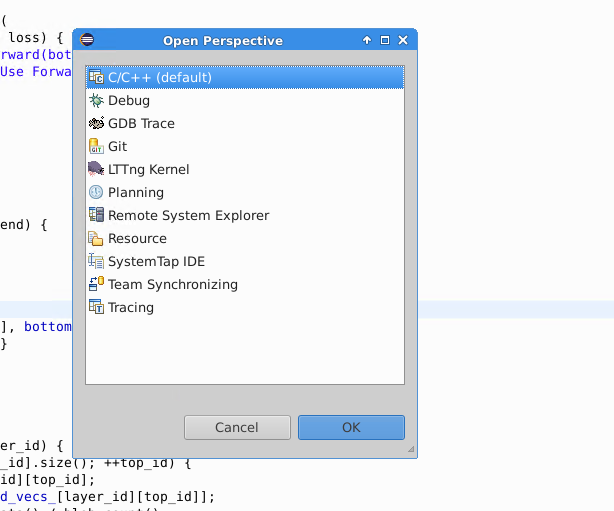
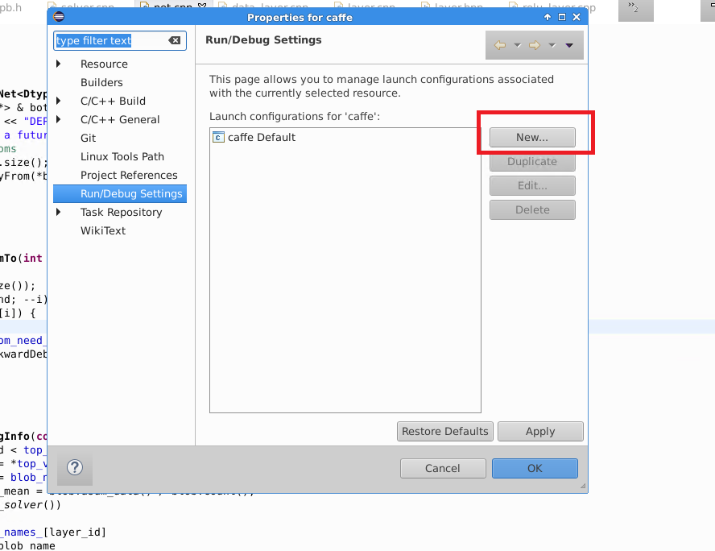
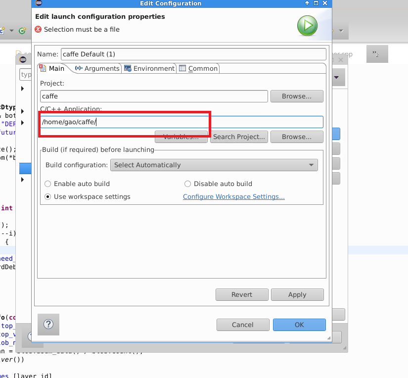
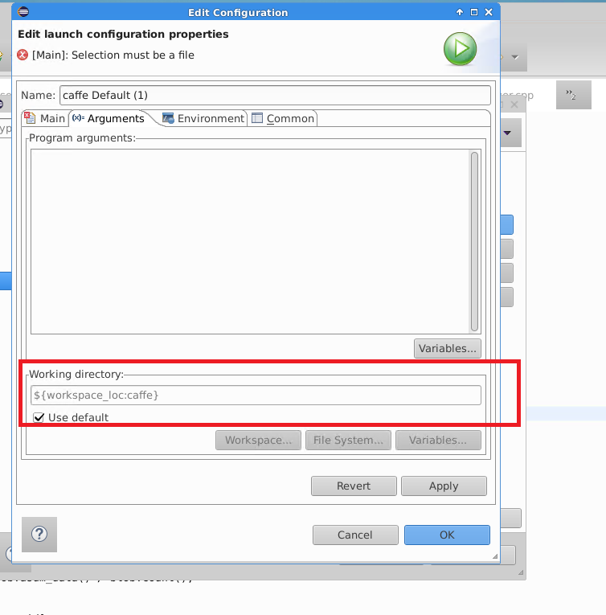

## Step_1
 * 

## Step_2 
 * 

## Step_3
 * 

## Step_4 
 * 
 
## Step_5
 ### 一定要注意的是这里填写的是debug后的编译的caffe, 编译debug的caffe要把Makefile中的debug改为1,然后再重新编译。###
 * 

## Step_6
 * 在红框内填入编译的caffe的路径
 * 

## Step_7
 * Debug 
