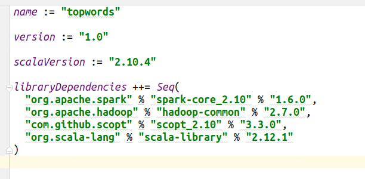

##sbt spark 项目，写在build.sbt
* 
* 注意spark 版本就选2.10.5或4，否则会出现问题

##spark 打包
 * File-->project struct-->Artifacts-->+-->jar--->from module with dependencies
 * Build-->Build Artifacts-->Build
 * 打成jar包后，运行时会出现一些问题, 解决办法见spark-intellij-wrong
 * 运行命令 scala ...jar(非spark项目)
