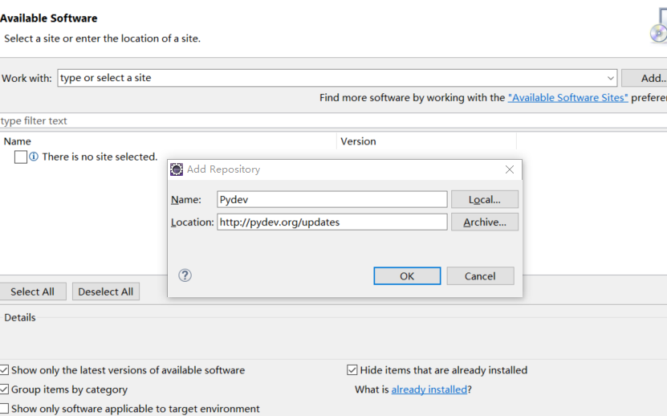

##jython
* 在官网上下载jython-installer.jar
* java -jar jython-installer.jar 进行安装

##Eclipse安装jython
* 先在Eclispe中安装Pydev插件方法
  * help -> install new software -> add 
   
  *重启后, windows-perfencens-在框中搜索Pydev 会出现配置(这里注意jython 高版本不行)
   搜索完后会出现一个对话框，点击Interpreter-Jython-> 在右边的框中点击new -> 不用写name, 点击下一个按钮选择上一步安装完的jython目录下的jython.jar文  件
   
  
  
  
