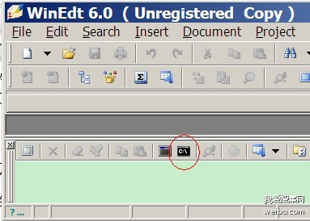

#latex首行无缩进
* 局部设置 \noident
* 全局设置 \usepackage{parskip}
* 换行 \medskip 不只是单倍行距

# 安装宏包
* 直接下载相应的.sty文件放到所在的文章目录下进行编译就可

#输入中文
* Document-->Document Setting-->format
* 选择utf8编码
* \document[UTF8]{article}
* \usepackage{CJK}
* \begin{CJK}{UTF8}{song}....\end{UTF8}

#加入背景色
* \usepackage{color}
* \definecolor{shadecolor}{rgb}{0.92,0.92,0.92}
* \begin{shaded}...\end{shaded}

#公式大括号
\\[P(X=x)=

   \begin{pmatrix}

            x-1 \\

            r-1

   \end{pmatrix}

\\]

#多行公式对齐
* \usepackage{amsmath}
* \\[

	\begin{aligned}

	.....

	\end{aligned}

	\\]
#写伪代码

* \usepackage{algorithm}
* \usepackage{algorithmicx}
* \usepackage{algpseudocode}
* \begin{algorithm}
* \begin{algorithmic}
   .....
  \end{algorithmic}
* \end{algorithm}

#latex调整字体大小
* http://blog.sina.com.cn/s/blog_5e16f1770100o3kp.html
* 调出左边框
* jpg转eps

	* 
	* bmeps -c(进行彩色转换) example.jpg example.eps

# 调整图片注释居中
* {figure*}[!htbp]
* 图片 ~\ref{fig1}
* 表格 ~\ref{tab1}
* 公式 ~\ref{eq:1}
* 公式对齐
	* \begin{aligned}
		 
		&.....\\ 

		&..... 
	
		\end{aligned}

* 输入法文字符 \" e

 
