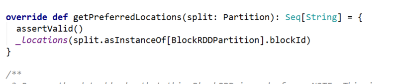

##spark 词袋模型

raw = 先抽取词

* 方法一：
  ```python
  dict = raw.flatMap(lambda x : x).distinct().collect()
  idx = 0
  all_terms_dict = {}
  for term in dict:
     all _terms_dict[item] = idx
     idx += 1
  ```
  
* 方法二
  ```python
  dict = raw.flatMap(lambda x : x).distinct().zipWithIndex().collectAsMap()
  ```

##spark 中两种操作transformation and action

  * transformation是得到一个新的RDD,方式很多,比如从数据源生成一个新的RDD,从RDD生成一个新的RDD
    * map 
    * filter
    * flatMap
    * mapPartitions
    * mapPartitionsWithSplit 
    * sample 
    * union 
    * distinct 
    * groupByKeey 
    * reduceByKey 
    * sortByKey 
    * join 
    * cogroup 
    * cartesian
  * action 是得到一个值，或者一个结果（直接将RDDcache到内存中）
所有的transformation都是采用的懒策略，就是如果将transformation提交是不会执行计算的，计算只有在action被提交时才被触发
    * reduce 
    * collect 
    * count 
    * first 
    * take 
    * takeSample 
    * saveAsTextFile 
    * saveAsSequenceFile 
    * countByKey 
    * foreach
  
  ##spark 缓存
 * 计算特别耗时
 * 计算链条很长
 * shuffle之后---shuffle从其他地方抓数据，要缓存下，如果后面阶段失败，从这个缓存阶段开始
 * checkpoint之前---一个作业执行完后，另一个作业开始前要checkpoint,缓存完这个作业的结果在进行下一个作业
 * 缓存不一定可靠因为缓存在内存中，checkpoint可靠。因为checkpoint在磁盘中
 * partition 会放在spark不同机器的节点上
 * partition一个特定的数据集合 大小默认是hdfs一个block的大小
 * Node local 本地磁盘
 * Process local 本地内存
 * Any 从其他机器shuffle来的数据

 ##spark运行原理图
 * 

 ## RDD（Resillent Distributed Dataset）
 * RDD是基于工作集的
 * RDD的弹性表现
    * 自动进行内存与磁盘数据存储和转换
    * 基于Lineage的高容错
    * Task如果失效会自动进行特定次数的重试
    * stage如果失败会自动进行特定次数的重试
    * checkpoint 和 persist
    * 数据调动弹性: DAG TASK和资源管理无关
    * 数据分片的弹性
      * 当partition很大，内存很小 partition调大。 例如 10000分片要变为1000分片:条用coalesce默认的shuffle为False, repartition默认shuffle为True
      * 当partition很小时，要把partition调大. 例如1000分片变为100000分片.这个过程一般要shuffle
  * 可以把RDD看成一个list or array
  * RDD通过记录数据更新的方式为何很高效
    * RDD是不可变的  + lazy
    * RDD是粗粒度的---RDD写操作是粗粒度的，读操作既可以是粗粒度也可以是细粒度

  * 每个RDD 在计算的时候都返回一个iterator对象
	  
	
	让所有的框架无缝集成
  * Java 不能调用子类接口而spark可以调用RDD子类方法由于(this.type)很强大

	  this.type 运行时支持, this.type 返回的接口会指向具体子类

  * 设置并行度，local模式下, spark就看集群中有多少core就用多少core
  * 最佳策略 spark并行度:每个core可以承载2-4个partition
  * 执行task的位置, 本地优先, 当触发job时(action触发), DAGScheduler调用submitMissingTasks 有一个taskIdToLocations,(id,getPrefereredLocs)决定      task的位置 
	* 若该RDD被缓存了,就直接取
	* 若RDD有preferredLocations（就是blockManager来管理,本地优先）
		
	
		
		
	
	* 若RDD是窄依赖，选择第一个窄依赖的第一个partition
	* partition的大小按理说应该是一个block大小(128M)但是最后一个partition可
		能跨两个block，所以一个partition的大小略小于或大于一个partition的大小
