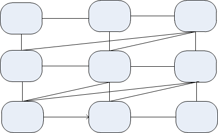

##lstm
 lstm 有三个重要的参数 batch, n_step, n_input, 通俗来说, batch 就是指样本数, n_step就是时间序列就是所谓的帧数, n_input 就是每帧的特征数.
 tensorflow 的lstm 先把输入x transpose成 [n_step,batch*n_input] 然后再split(0,n_step) split中0代表维度, n_step代表要切分多少个, 返回值是list
 以这个为例就是返回了一个list, 长度为n_step, 每个元素的维度是[batch\*n_input], 这也就意味者有n_step 个cell
 
 ```python
 concat = _linear([inputs,h],4*self._num_units,True)
 i,j,f,o = array_ops.split(1,4,concat)
 new_c = (c*sigmoid(f+self._forget_bias) + sigmoid(i) * self._activation(j))
 new_h = self._activation(new_c) * sigmoid(o)
 ```
 
 但是tensorflow 的 bidirectional_dynamic_rnn(cell_fw,cell_bw,inputs,sequence_length,dytype)要求的输入不是上面的list, 而是一个三位数组          [batch,n_step,n_input], sequence_length 是实际的每个序列(每个样本有多少时序)的长度 np.ones(batch)*n_step, 还有一个重要的参数 time_major
如果是true, input是[n_step,batch,n_input]

lstm不可重复使用, 比如有n个hidden，每个hidden后，经过一个lstm 
```python
for h in hidden:
 ....
 ....
 lstm
```
这时会报 ./lstm/cell/W_0 distableed错误

##获取维度
  * variant.get_shape().as_list()
  * variant.get_shape().with_rank_at_least(3) 维度至少为3
  * tf.while_loop(cond,body,loop_vars.....) cond 条件 ，body 函数， loop_vars 存储每步的变量以便下次迭代使用 
    在dynamic_rnn函数中看到。
  

## CustomMultiLstmCell

```python
import tensorflow as tf
class CustomMultiRNNCell(RNNCell):
  """RNN cell composed sequentially of multiple simple cells."""

  def __init__(self, cells, state_is_tuple=True):
    """Create a RNN cell composed sequentially of a number of RNNCells.

    Args:
      cells: list of RNNCells that will be composed in this order.
      state_is_tuple: If True, accepted and returned states are n-tuples, where
        `n = len(cells)`.  If False, the states are all
        concatenated along the column axis.  This latter behavior will soon be
        deprecated.

    Raises:
      ValueError: if cells is empty (not allowed), or at least one of the cells
        returns a state tuple but the flag `state_is_tuple` is `False`.
    """
    if not cells:
      raise ValueError("Must specify at least one cell for MultiRNNCell.")
    self._cells = cells
    self._state_is_tuple = state_is_tuple
    self.hs = []
    #self.u = tf.Variable(tf.truncated_normal([len(cells)-1,cells[0]._num_units, cells[0]._num_units]),name='u_v')
    if not state_is_tuple:
      if any(nest.is_sequence(c.state_size) for c in self._cells):
        raise ValueError("Some cells return tuples of states, but the flag "
                         "state_is_tuple is not set.  State sizes are: %s"
                         % str([c.state_size for c in self._cells]))

  @property
  def state_size(self):
    if self._state_is_tuple:
      return tuple(cell.state_size for cell in self._cells)
    else:
      return sum([cell.state_size for cell in self._cells])

  @property
  def output_size(self):
    return self._cells[-1].output_size

  def __call__(self, inputs, state, scope=None):
    """Run this multi-layer cell on inputs, starting from state."""
    with vs.variable_scope(scope or type(self).__name__):  # "MultiRNNCell"
      U = tf.get_variable('U',[self._cells[0]._num_units, self._cells[0]._num_units])
      cur_state_pos = 0
      cur_inp = inputs

      new_states = []
      h = []
      if self.hs:
          for i, cell in enumerate(self._cells):
            with vs.variable_scope("Cell%d" % i):
                if i == 0:
                   #当i为0时，是最下面一层,与高层没有连线,所以正常执行
                    cur_state = state[i]
                    cur_inp,new_state = cell(cur_inp,cur_state)
                else:
                    #cur_inp,new_state = cell(cur_inp,cur_state)
                    #现获得最后一次的cur_inp
                    cur_inp = h[-1]
                    #self.hs存放每个时间段的cur_inp,存放的类型是tuple,self.hs是一个list
                    #假设有3层，例如第一个时间段，list的元素是tuple类型，每个tuple是三个元素,每个元素分别对应第一个时间段的cur_inp
                    for us in self.hs:
                        #U = tf.get_variable('U%d'%i,[128,128])
                        #这里的sigmoid主要是记录要忘掉过去多少
                        cur_inp += tf.nn.sigmoid(tf.matmul(us[i-1],U))
                    #cur_inp = tf.nn.relu(cur_inp)
                    cur_inp,new_state = cell(cur_inp,cur_state)
                new_states.append(new_state)
                h.append(cur_inp)
      else:
          for i, cell in enumerate(self._cells):
            with vs.variable_scope("Cell%d" % i):
              if self._state_is_tuple:
                if not nest.is_sequence(state):
                  raise ValueError(
                      "Expected state to be a tuple of length %d, but received: %s"
                      % (len(self.state_size), state))
                cur_state = state[i]
              else:
                cur_state = array_ops.slice(
                    state, [0, cur_state_pos], [-1, cell.state_size])
                cur_state_pos += cell.state_size
              cur_inp, new_state = cell(cur_inp, cur_state)
              new_states.append(new_state)
              h.append(cur_inp)
    new_states = (tuple(new_states) if self._state_is_tuple
                  else array_ops.concat(1, new_states))
    h = (tuple(h) if self._state_is_tuple
                  else array_ops.concat(1, h))
    self.hs.append(h)
    return cur_inp, new_states

```


 
 
 
 
 
